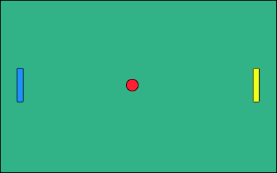

# Ping-pong
Создать игру Ping-pong.

## Development steps
- Создать проект с названием `ping-pong`
- Создать `view` (т.е. UI)
- Создать `controller`
- Добавить `listeners`, для `events` "нажатиe на `key`", которые выводят в `console` строку `Pressed: ${keyName}`
- Привязать `objects`: `playerPaddle`, `botPaddle` и `ball` к `controller`
- Усовершенствовать `listeners`, который для `events` будет приводить в движение `playerPaddle` при нажатии на соответствующие `key`
- Реализовать движение `ball` по полю
- Реализовать взаимодействие `ball` и `paddle`
- Реализовать подсчет `score`
- *Разработать бота для второго игрока
- **Усовершенствовать бота для второго игрока
- ***Усовершенствовать движение мяча